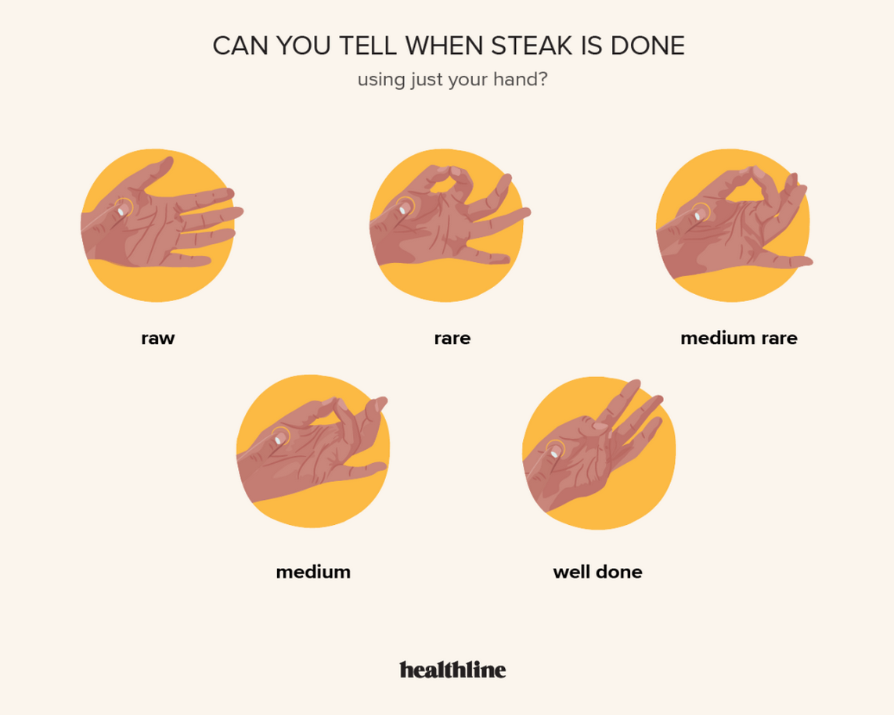

## How to Use
Touch your thumb to each finger gently, then press the fleshy part under your thumb.  
Compare that feeling to the firmness of the steak.

## Steak Doneness Levels
| Doneness | Hand Test | Steak Texture | Inside Colour |
|---|---|---|---|
| Raw | Open hand, relaxed palm | Very soft | Red and uncooked |
| Rare | Thumb touching index finger | Soft | Red centre |
| Medium Rare | Thumb touching middle finger | Slightly firm | Warm red/pink centre |
| Medium | Thumb touching ring finger | Firm | Pink centre |
| Well Done | Thumb touching pinky finger | Very firm | Brown throughout |

## Steps
1. Keep your hand relaxed for **raw**.
2. Touch your thumb to your index finger for **rare**.
3. Touch your thumb to your middle finger for **medium rare**.
4. Touch your thumb to your ring finger for **medium**.
5. Touch your thumb to your pinky finger for **well done**.
6. Press the fleshy part below your thumb and compare it with the steak.

## Tips
- Do not press too hard with your fingers; keep the touch light.
- This method is only a rough guide.
- For accurate results, use a meat thermometer.
- Let steak rest after cooking so the juices stay inside.