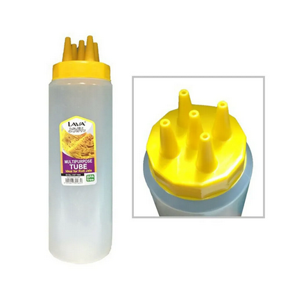

## Ingredients
- 500 g plain flour
- 1 egg
- 250 ml coconut milk
- 600 ml water
- 1/2 tsp turmeric powder
- 1/2 tsp salt
- 1 tsp sugar
- 1 tbsp cooking oil
- Extra oil, for brushing the pan

## Steps
1. Blend flour, egg, coconut milk, water, turmeric powder, salt, sugar and oil.
2. Mix until smooth.
3. Strain the batter to remove lumps.
4. Pour the batter into a roti jala squeeze bottle.
5. Heat a non-stick pan and lightly brush with oil.
6. Pipe the batter in a lace pattern onto the pan.
7. Cook for 1–2 minutes until set. No need to flip.
8. Fold or roll the roti jala.
9. Repeat with the remaining batter.

## Tips
1. The batter should be thin enough to flow easily.
2. Straining the batter makes the roti jala smoother.
3. Keep the heat medium-low so it does not brown too much.